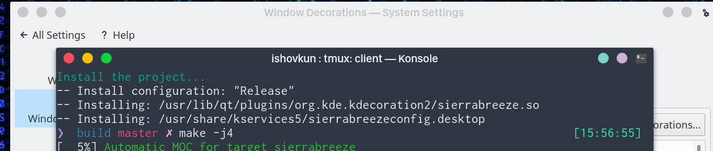

# SierraBreeze

Sierra Breeze is a fork of Breeze Window decoration that aims to mimic the
OSX Sierra titlebar buttons.


## Install

### Debian/Ubuntu

Debian/Ubuntu users can install by using the PPA maintained by Thomas Pietrowski:

``` shell
sudo add-apt-repository ppa:thopiekar/sierrabreeze
sudo apt update
sudo apt install sierrabreeze
```

### Arch Linux

SierraBreeze can also be installed from the [AUR](https://aur.archlinux.org/packages/sierrabreeze-kwin-decoration-git/) using
``` shell
yaourt sierrabreeze-kwin-decoration-git
```

### OpenSUSE

SierraBreeze can also be installed with zypper
``` shell
zypper addrepo https://download.opensuse.org/repositories/home:trmdi/openSUSE_Tumbleweed/home:trmdi.repo
zypper refresh
zypper install sierra-breeze
```
or using the binary package https://software.opensuse.org//download.html?project=home%3Atrmdi&package=sierra-breeze.

## Build
There are some dependencies you'll need to build from source. Some people
suggested using the following commands:

### Ubuntu
``` shell
sudo apt install build-essential libkf5config-dev libkdecorations2-dev libqt5x11extras5-dev qtdeclarative5-dev extra-cmake-modules libkf5guiaddons-dev libkf5configwidgets-dev libkf5windowsystem-dev libkf5coreaddons-dev gettext
```

### Arch Linux
``` shell
sudo pacman -S kdecoration qt5-declarative qt5-x11extras    # Decoration
sudo pacman -S cmake extra-cmake-modules                    # Installation
```

### Fedora
``` shell
sudo dnf install cmake extra-cmake-modules  
sudo dnf install "cmake(Qt5Core)" "cmake(Qt5Gui)" "cmake(Qt5DBus)" "cmake(Qt5X11Extras)" "cmake(KF5GuiAddons)" "cmake(KF5WindowSystem)" "cmake(KF5I18n)" "cmake(KDecoration2)" "cmake(KF5CoreAddons)" "cmake(KF5ConfigWidgets)"
```


In order to install the theme and add it to your decorations do the following:
``` shell
git clone https://github.com/ishovkun/SierraBreeze
cd SierraBreeze
mkdir build
cd build
cmake .. -DCMAKE_INSTALL_PREFIX=/usr -DCMAKE_BUILD_TYPE=Release -DKDE_INSTALL_LIBDIR=lib -DBUILD_TESTING=OFF -DKDE_INSTALL_USE_QT_SYS_PATHS=ON
sudo make install
```
To avoid logging out, issue
``` shell
kwin_x11 --replace &
```
That is it! Your new decoration theme should appear in
*Settings &rarr; Application Style &rarr; Window Decorations*.

## Acknowledgments:
- The authors of Breeze window decorations Martin Gräßlin and Hugo Pereira Da Costa
- Andrey Orst, the author of Breezemite Aurorae window decoration
https://github.com/andreyorst/Breezemite
- Chris Holland for his blog about patching Breeze decorations
https://zren.github.io/projects/2017/07/08/patching-breeze-window-decorations.html
